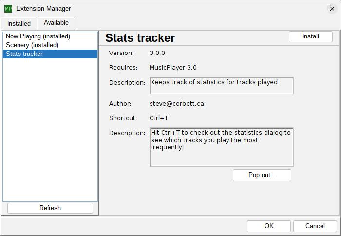
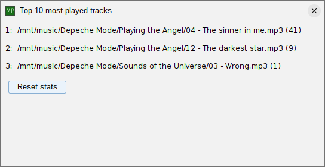

# ext-mp-stats-tracker

## What is this?

This is an extension for the [musicplayer](https://github.com/scorbo2/musicplayer) application which allows
tracking of how many times each track is played, so you can view listening statistics in the stats dialog.

## How do I get it?

### Option 1: automatic download and installation

**NEW** starting in MusicPlayer 3.0, you no longer have to build and install the extension yourself! You can use the
new and improved extension manager feature that lets you download the jar through the application
and install it automatically!



Navigate to the "available" tab on the extension manager dialog and pick "Stats tracker" from the list
on the left. Then click the "install" button in the top right. The application will prompt you to restart,
and that's it! To remove the extension, revisit the extension manager dialog, select "Stats tracker"
on the "Installed" tab, and hit the "uninstall" button in the top right. It's just that easy!

### Option 2: manual download and installation

Alternatively, you can manually download the extension jar: 
[ext-mp-stats-tracker-3.1.0.jar](http://www.corbett.ca/apps/MusicPlayer/extensions/3.1/ext-mp-stats-tracker-3.1.0.jar)

Then save it in your ~/.MusicPlayer/extensions directory and restart the application.

### Option 3: clone and build from source

You can clone this repo and build the extension jar with maven (Java 17 or higher required):

```shell
git clone https://github.com/scorbo2/ext-mp-stats-tracker.git
cd ext-mp-stats-tracker
mvn package # NOTE! You must have MusicPlayer-3.1 in your local maven repository for this to work!

# Copy the result to the extensions directory:
cp target/ext-mp-stats-tracker-3.1.0.jar ~/.MusicPlayer/extensions
```
## Okay, it's installed, how do I use it?

You don't need to do anything once the extension is installed - it will automatically keep track of
what tracks you listen to, and how often. You can press Ctrl+T from the main 
MusicPlayer window to bring up the stats dialog:



This shows you a list of your top 10 most listened-to tracks, along with the total play count for each of them.

### Requirements

MusicPlayer 3.1 or higher.

### License

MusicPlayer and this extension are made available under the MIT license: https://opensource.org/license/mit
